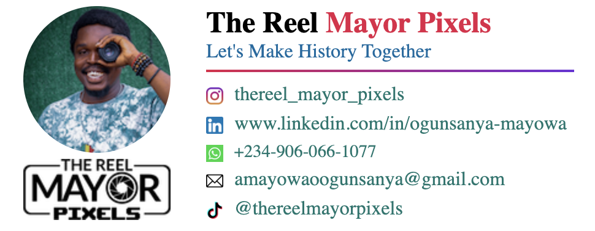

# The Reel Mayor Pixels - Email Signature

A professional and customizable email signature for "The Reel Mayor Pixels" brand with multiple color variations.

## 📋 Table of Contents

- [Overview](#overview)
- [Features](#features)
- [Screenshots](#screenshots)
- [Installation](#installation)
- [Usage](#usage)
- [Color Variations](#color-variations)
- [Customization](#customization)
- [Files Structure](#files-structure)
- [Technologies Used](#technologies-used)
- [Author](#author)
- [License](#license)

## 🔍 Overview

This project contains HTML email signature templates designed for "The Reel Mayor Pixels" brand. The signatures are designed to be responsive, professional, and easy to implement across various email platforms. Three different color variations are provided to match different branding needs or personal preferences.

## ✨ Features

- Responsive design compatible with most email clients
- Three distinct color schemes
- Professional layout with contact information
- Social media icons with links
- Circular profile image
- Brand logo integration
- Clean, modern aesthetic

## 📸 Screenshots

### Red & Purple Variation


### Teal Variation


### Green & Purple Variation


## 💻 Installation

1. Clone the repository:
   ```bash
   git clone https://github.com/Sado1111/my-first-email_signatures/3-email-signature.git
   ```
2. Navigate to the project directory:
   ```bash
   cd email-signature
   ```

## 🚀 Usage

### Method 1: Copy HTML Directly

1. Open your preferred HTML file (variation1.html, variation2.html, or variation3.html)
2. Copy the entire HTML code
3. Open your email client settings where you can add an HTML signature
4. Paste the HTML code as your signature
5. Save your settings

### Method 2: Screenshot Method (For clients with limited HTML support)

1. Open the HTML file in a browser
2. Take a screenshot of the rendered signature
3. Crop the image as needed
4. Add the image as your email signature

## 🎨 Color Variations

The project includes three distinct color schemes:

### Variation 1 (Red & Purple)
- Name highlight: Rose Red (#E11D48)
- Tagline color: Blue (#0369A1)
- Horizontal line: Gradient from Rose Red (#E11D48) to Purple (#6D28D9)
- Link color: Teal (#0F766E)

### Variation 2 (Teal)
- Name highlight: Teal (#2C7A7B)
- Tagline color: Gray (#4A5568)
- Horizontal line: Solid Teal (#2C7A7B)
- Link color: Green (#059669)

### Variation 3 (Green & Purple)
- Name highlight: Green (#16A34A)
- Tagline color: Purple (#6D28D9)
- Horizontal line: Gradient from Green (#16A34A) to Purple (#6D28D9)
- Link color: Mix of Green (#276749) and Teal (#0F766E)

## 🔧 Customization

To customize the signature for your own use:

1. Replace the image URLs:
   - Profile image: Update the `src` attribute of the first `` tag
   - Logo: Update the `src` attribute of the second `` tag

2. Modify the text content:
   - Update the name in the `<h2>` element
   - Change the tagline in the paragraph following the name

3. Update contact information:
   - Replace the href attributes and text for all social media and contact links

4. Change colors:
   - Modify color values in the style attributes to match your branding

## 📁 Files Structure

```
3-email-signature/
├── 1-email_signature.png       # First Email Signature variation
├── 2-email_signature.png       # Second Email Signature variation
├── 3-email_signature.png       # Third Email Signature variation
├── variation1.html             # Red & Purple color scheme
├── variation2.html             # Teal color scheme
├── variation3.html             # Green & Purple color scheme
└── README.md                   # Project documentation
```

## 💡 Technologies Used

- HTML
- CSS (inline for email compatibility)
- Responsive design techniques
- Social media icons from Flaticon

## 👤 Author

Hannah Sado 

## 👤 About

**The Reel Mayor Pixels**

- Instagram: [@thereel_mayor_pixels](https://www.instagram.com/thereel_mayor_pixels)
- LinkedIn: [Ogunsanya Mayowa](https://www.linkedin.com/in/ogunsanya-mayowa)
- WhatsApp: [+234-906-066-1077](https://wa.link/1f3n3a)
- Email: [amayowaoogunsanya@gmail.com](mailto:amayowaoogunsanya@gmail.com)
- TikTok: [@thereelmayorpixels](https://www.tiktok.com/@thereelmayorpixels)

## 📄 License

This project is licensed under the MIT License - see the LICENSE file for details.

---

Feel free to reach out if you have any questions or need further customization!